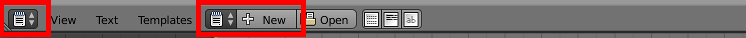
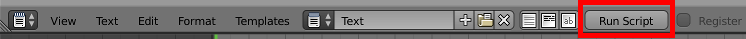
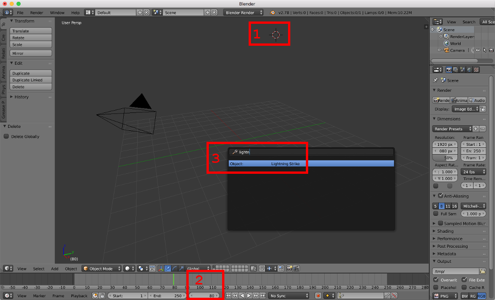
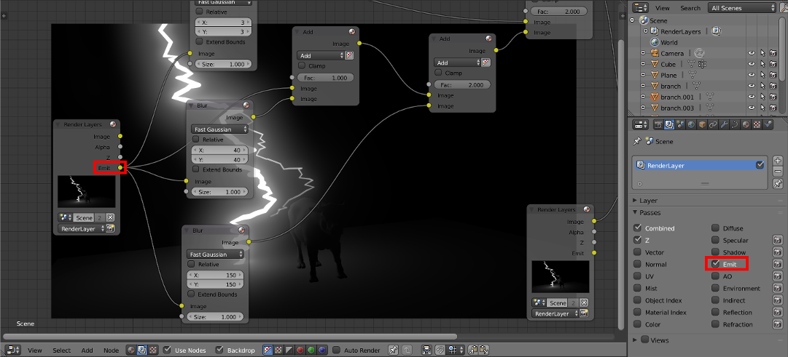

# Lightning Strike Generator

## Bring Your Own Cow

The included `cow.blend` file was created with Blender 2.78a.

## Summary

This Blender addon generates and animates lightning strikes using the method described by Andrew Price (a.k.a. Blender Guru) in [this](https://www.youtube.com/watch?v=LB0dphDcC7g) tutorial.

## A test drive

1. Open Text Editor view
1. Click New

  
1. Paste script into the text editor
1. Click Run Script

  

The addon will now be available from the spacebar menu.  The script will be saved in the blend file along with the rest of the project.   When Blender is restarted, the script will have to be run again in order to register the addon.

## Permanent installation

Save `lightning_v1.py` file locally and follow `Install from File` instructions [here](https://www.blender.org/manual/preferences/addons.html).

## Generating lightning

1. Place the 3D cursor where lightning origin will be
1. Set current frame where animation will begin
1. Press `SPACE`
1. Type in `Lightning Strike`
  - The addon should show up on the menu
1. Click it

## Configuration options

- **Height** - total height of the lightning strike
- **Shape Seed** - randomizer seed that determines the shape of the strike
- **Step Size** - distance between points, applied to x, y, and z coordinates
- **Branches** - number of branches on each level
- **Levels** - number of times branches will sprout sub-branches
- **Animation Seed** - randomizer seed for key frame locations and emit intensities
- **Flashes** - number of times the bolt will flash. The last flash will always be the brightest

## Lightning glow effect

The Blender Guru tutorial describes one method for adding the glow effect to the lightning.  In order to use that method, make sure that the layer dedicated to lightning objects is selected before the addon is executed.  This will allow separating lightning into its own Render Layer that can then be used to add glow.  Watch the tutorial for details.

However, there is an alternative that allows placing lightning in the same layer with all other objects.

Navigate to the `Render Layers` tab and select `Passes` -> `Emit`.  This option will generate emit pass data from the layer which can be used with Nodes to create the lightning glow effect.  This set up can be found in the included `cow.blend` file.

There are two advantages in using the emit pass data:

- Lightning can be partially obscured by an object or it can pass through an object.
- Lightning can cast light on other objects in the same layer.
